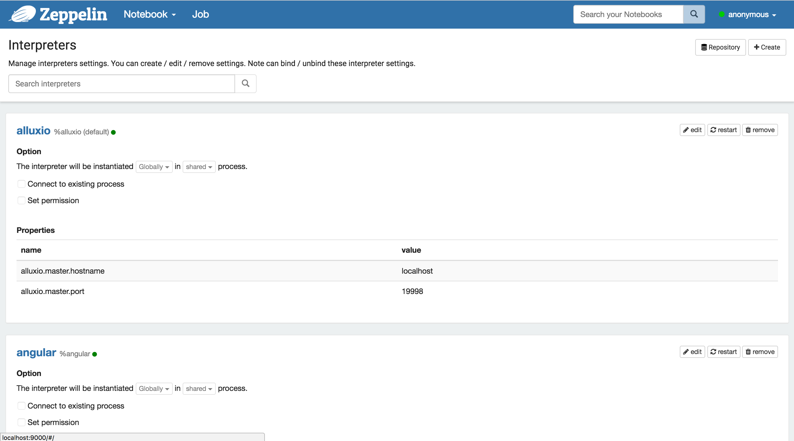
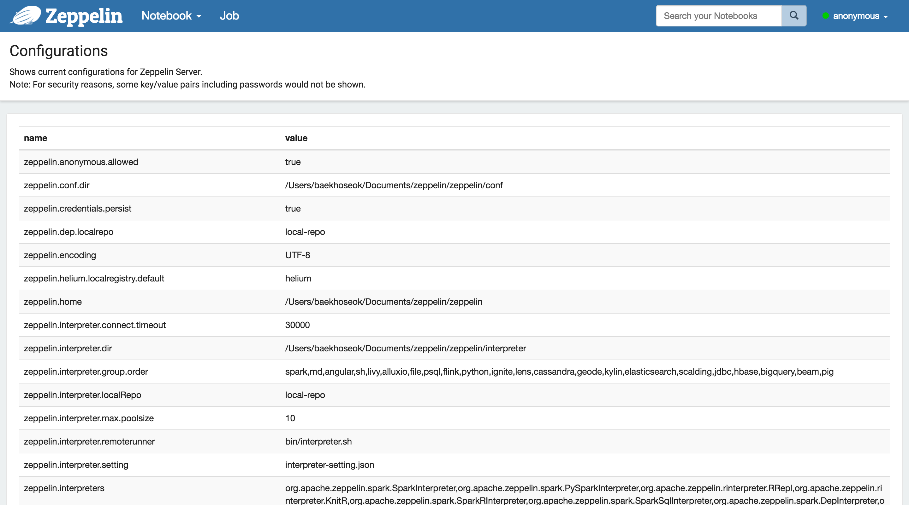

<!--
Licensed under the Apache License, Version 2.0 (the "License");
you may not use this file except in compliance with the License.
You may obtain a copy of the License at

http://www.apache.org/licenses/LICENSE-2.0

Unless required by applicable law or agreed to in writing, software
distributed under the License is distributed on an "AS IS" BASIS,
WITHOUT WARRANTIES OR CONDITIONS OF ANY KIND, either express or implied.
See the License for the specific language governing permissions and
limitations under the License.
-->


# 아파치 제플린 UI 탐색

## 메인 홈

제플린에 처음 연결하면 아래 화면 캡쳐와 비슷한 메인 페이지를 볼 수 있습니다.

페이지의 왼쪽은 존재하는 notes의 모든 목록입니다. 그 note들은 기본으로 `$ZEPPELIN_HOME/notebook` 폴더에 저장됩니다.

입력 텍스트 양식을 사용해서 이름으로 필터링할 수 있습니다. 새 note를 만들고, (수동으로 `$ZEPPELIN_HOME/notebook` 폴더에 복사한 경우) note 목록을 갱신하고 가져올 수 있습니다. 

`Import Note` 링크를 클락하면 새 대화 상자가 나타납니다. 그 대화 상자로 로컬 디스크나 당신이 제공한 URL 원격지로 note를 가져올 수 있습니다.

기본으로 가져온 onte의 이름은 원본 note와 같다. 하지만 새 이름으로 대체할 수 있습니다.

 
## 메뉴

### Notebook

`Notebook` 메뉴는 홈페이지의 note 관리와 거의 동일한 기능을 제공합니다. 드롭 다운 메뉴에서 아래 기능을 수행할 수 있습니다.

1. 선택된 메모 열기
2. 이름으로 note 필터링
3. 새 note 생성

### 설정
이 메뉴는 제플린에 대한 설정과 출력 정보에 접근할 수 있도록 합니다. shiro 구성의 기본값을 사용하면 사용자 이름은 `anonymous` 로 설정됩니다. 인증을 설정하려면 [Shiro 인증](../security/shiroauthentication.html)을 참조하세요.

#### 제플린 소개

이 메뉴에서 제플린 버전을 확인할 수 있습니다.

#### 인터프리터

이 메뉴에서는 

1. 기존 **인터프리터 인스턴스** 구성
2. **인터프리터 인스턴스** 추가 및 제거

#### 자격 증명

이 메뉴는 인터프리터에 전달되는 데이터 소스의 자격 증명을 관리합니다.

#### 구성

이 메뉴는 구성 파일 `$ZEPPELIN_HOME/conf/zeppelin-site.xml`에서 설정된 모든 제플린 구성을 출력합니다.

 
## Note 레이아웃

각 제플린 note는 Each 1..N paragraphs로 구성되어있습니다. note는 paragraph container로 볼 수 있습니다.

### Paragraph

각 paragraph은 두 섹션으로 구성되어있습니다. 소스 코드를 넣을 `코드 섹션`과 코드 실행의 결과를 볼 수 있는  `결과 섹션`이 있습니다..

각 paragraph의 오른쪽 상단에 몇 가지 명령을 할 수 있습니다. 

* paragraph 코드 실행
* `code section` 노출 및 숨기기
* `result section` 노출 및 숨기기
* paragraph 구성

paragraph를 구성하기 위해 gear 아이콘을 클릭하세요.

이 대호상자로부터 아래를 할 수 있습니다.

* **paragraph id** 찾기( **20150924-163507_134879501** )
* paragraph 폭 제어. 제플린은 **Twitter Bootstrap**의 그리드 시스템을 사용하기때문에, 각 paragraph 폭은 1에서 12 사이의 값을 가질 수 있습니다.
* paragraph 수준을 한 수준 위로 이동
* paragraph 수준을 한 수준 아래로 이동
* 새 paragraph 생성
* paragraph 제목 변경
* `code section`에서 줄 번호 노출 및 숨기기
* 이 paragraph에서 실행 버튼 비활성화
* 현재 paragraph를 **iframe**으로 내보내고 새 창으로 엽니다. 
* `result section`을 청소
* 현재 paragraph을 제거

### Note 툴바

note의 상단에서 명령 버튼, 구성, 보안, 출력 옵션을 나타내는 툴바가 있습니다.

가장 오른쪽에 note 이름이 출력되고, 입력 양식을 표시하고 업데이트하려면 클릭합니다.

툴바의 중간에는 명령어 버튼이 있습니다.

* 모든 paragraphs를 표시 순서에서 **순차적으로** 실행합니다.
* 모든 paragraphs의 `code section` 노츨/숨기기
* 모든 paragraphs의 `result section` 노츨/숨기기
* 모든 paragraphs의 `result section` 청소
* 현재 note를 복제
* 현재 note를 JSON 파일로 내보내기. _모든 paragraphs의 `code section`과 `result section`을 내보냅니다. 일부 paragraphs의 `result section`에 무거운 데이터를 가지고 있다면, 내보내기 전에 청소할 것을 권장합니다.
* 현재 note 컨텐츠 커밋
* note 삭제
* CRON syntax을 사용하여 **all paragraph**의 실행 계획 수립

note 툴바의 오른쪽에 구성 아이콘이 있습니다.

* 모든 단축키 출력
* 인터프리터를 현재 note와 바인딩되도록 구성
* note 권한 구성
* node 출력 모드(`default`, `simple` and `report`) 전환

